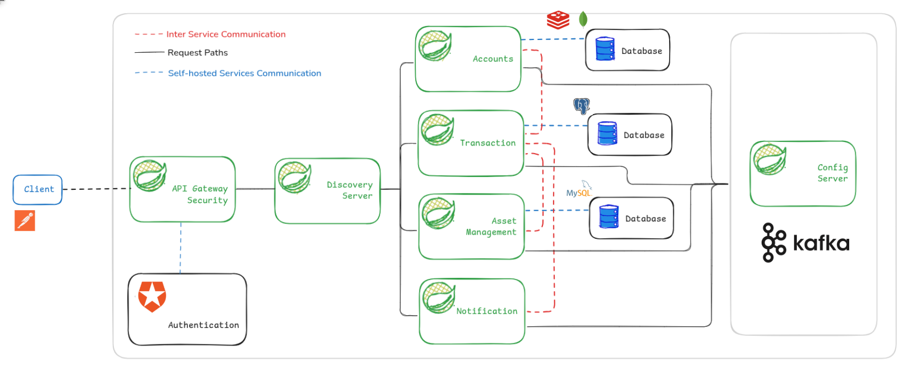

# Veritas Bank Microservices Platform

## 1. Introduction

Veritas Bank is a modern, cloud-native banking platform built using a microservices architecture. The application leverages the Netflix OSS stack to provide scalable, resilient, and discoverable services. Core features include user management, transaction processing, and real-time notifications, all accessible through a unified API gateway and a responsive web interface.

**Key Features:**

- User registration, authentication, and profile management
- Secure money transfers and transaction history
- Real-time notifications for account activity
- Service discovery, load balancing, and fault tolerance
- Centralized API gateway for all client requests

## 2. Architecture

### 2.1 Architectural Diagram

### 2.2 Design Decisions

- **Service Decomposition:**
  - **User Service:** Handles authentication, registration, and user profiles. Decoupled for independent scaling and security.
  - **Transaction Service:** Manages all financial operations, ensuring transactional integrity and auditability.
  - **Notification Service:** Sends real-time alerts via email/SMS, decoupled for asynchronous processing.
  - **Netflix OSS Stack:**
  - **Spring Boot** for rapid service development.

## 3. Microservices

### 3.1 Implementation Stack

- **Spring Boot**: Rapid development of RESTful services
- **Eureka**: Service registry and discovery

### 3.2 Core Services

#### 3.2.1 Account Service

- **Functionality:** User account creation, retrieval, update, and deletion; debit/credit operations.
- **Endpoints:**
  | Method | Endpoint | Description |
  |--------|----------------------------|---------------------------------------------|
  | POST | `/api/account` | Create a new bank account |
  | GET | `/api/account` | Get all accounts for the authenticated user |
  | DELETE | `/api/account` | Delete account by account holder name (body)|
  | DELETE | `/api/account/{id}` | Delete account by account ID |
  | GET | `/api/account/{id}` | Get account details by ID |
  | POST | `/api/account/{id}/debit` | Debit an account by ID |
  | POST | `/api/account/{id}/credit` | Credit an account by ID |
- **Inter-service:**
  - Registers with Eureka for discovery

#### 3.2.2 Transaction Service

- **Functionality:** Handles all account transactions and transaction history.
- **Endpoints:**
  | Method | Endpoint | Description |
  |--------|----------------------|---------------------------------------------|
  | POST | `/api/transaction` | Process a transaction (async, body: TransactionRequest) |
  | POST | `/api/transaction` | Deposit (async, body: deposit type TransactionRequest) |
  | POST | `/api/transaction` | Withdraw (async, body: withdraw type TransactionRequest) |
  | GET | `/api/transaction` | Get all transactions for the authenticated user |
- **Inter-service:**
  - Notifies Notification Service on transaction events (via Kafka)
  - Registers with Eureka

#### 3.2.3 Asset Management Service

- **Functionality:** Manages assets, their availability, and updates.
- **Endpoints:**
  | Method | Endpoint | Description |
  |--------|------------------------------------------|-----------------------------------------------------|
  | GET | `/api/asset-management` | Check asset availability (query: assetCode, amount) |
  | POST | `/api/asset-management/update-amount` | Update asset amount (query: assetCode, amount) |
  | POST | `/api/asset-management` | Create a new asset (body: Asset) |
  | GET | `/api/asset-management/{id}` | Get asset by ID |
  | GET | `/api/asset-management/all` | List all assets |
  | PUT | `/api/asset-management/{id}` | Update asset by ID (body: Asset) |
  | DELETE | `/api/asset-management/{id}` | Delete asset by ID |
- **Inter-service:**
  - Registers with Eureka

#### 3.2.4 Notification Service

- **Functionality:** Sends notifications (email/SMS/WebSocket) for account activity and alerts.
- **Endpoints:**
  - **No REST endpoints are exposed.**
  - Operates via Kafka listeners and WebSocket notifications.
  - Listens to the `notificationTopic` Kafka topic and sends notifications to users via WebSocket (`/topic/notifications/{userId}`).
- **Inter-service:**
  - Consumes messages from Transaction Service (via Kafka)
  - Registers with Eureka

### 3.3 Discovery Server (Eureka)

- All services register with Eureka at startup.
- Eureka dashboard provides health status and instance monitoring.
- Enables dynamic scaling and failover.

### 3.4 API Gateway (Spring cloud gateway)

- **Configuration:**
  - Routes all `/api/*` traffic to appropriate services
  - Handles authentication, rate limiting, and CORS
  - Uses Eureka for dynamic routing
- **Role:**
  - Single entry point for all clients
  - Centralized logging and security

### 3.5 Authentication & Security

### Auth0 Integration
- **Authentication Provider:** The platform uses [Auth0](https://auth0.com/) for secure user authentication and authorization.
- **How it works:**
  - Users log in or register via Auth0's hosted login page.
  - Upon successful authentication, Auth0 issues a JWT (JSON Web Token) to the client.
  - The JWT is included in the `Authorization: Bearer <token>` header for all API requests.
  - The API Gateway and backend services validate the JWT to ensure the request is authenticated and authorized.
- **Benefits:**
  - Centralized, secure authentication with support for social logins, SSO, and MFA.
  - Simplifies user management and security best practices.
- **Service Integration:**
  - The API Gateway enforces authentication for protected routes.
  - Backend services extract the user identity from the JWT for authorization and data scoping.

## 4. User Interface

### 4.1 Implementation

- **Framework:** React.js (with Redux or Context API for state management)
- **API Integration:** Fetch for REST calls via api-gateway
- **Features:**
  - User registration/login forms
  - Dashboard for account overview and transactions
  - Real-time notification panel

### 4.2 API Testing

- **Postman:** Used for manual API testing and collection sharing

## 5. Deployment

### 5.1 Local Deployment

- Prerequisites: Java 17+, Docker, Maven
- Steps:
  1. Clone the repository
  2. Start Config server: `cd be/config-server && mvn spring-boot:run`
  3. Start each microservice: `cd be/user-service && mvn spring-boot:run` (repeat for others)
  4. Start frontend: `cd fe && pnpm install && pnpm dev`

### 5.2 Docker Deployment

- Each service includes a `Dockerfile`
- Use `docker-compose` for orchestration:
- Start all: `docker-compose up --build`

### 5.3 Cloud Deployment

- Deploy to AWS ECS, Azure AKS, or Google GKE
- Use managed databases and message brokers
- Configure environment variables and secrets

## 6. Source Code

- **GitHub Repository:** [https://github.com/your-org/veritas-bank-microservices](https://github.com/your-org/veritas-bank-microservices)

### 6.1 Development Challenges & Solutions

- **Service Communication:** Used Eureka and Ribbon for dynamic service discovery and load balancing.
- **Fault Tolerance:** Integrated Hystrix for circuit breaking and fallback logic.
- **API Security:** JWT-based authentication at the gateway and service level.
- **Data Consistency:** Used distributed transactions and message queues for eventual consistency.
- **Testing:** Employed Postman and Swagger for API validation and contract testing.

## 7. References

- [Spring Cloud Netflix](https://cloud.spring.io/spring-cloud-netflix/)
- [Spring Boot Documentation](https://docs.spring.io/spring-boot/docs/current/reference/html/)
- [Netflix Eureka](https://github.com/Netflix/eureka)
- [Netflix Zuul](https://github.com/Netflix/zuul)
- [Microservices application](https://github.com/zoltanvin/royal-reserve-bank.git)
- [Netflix Ribbon](https://github.com/Netflix/ribbon)
- [Netflix Hystrix](https://github.com/Netflix/Hystrix)
- [Docker Documentation](https://docs.docker.com/)
- [React Documentation](https://react.dev/)
- [Postman](https://www.postman.com/)
